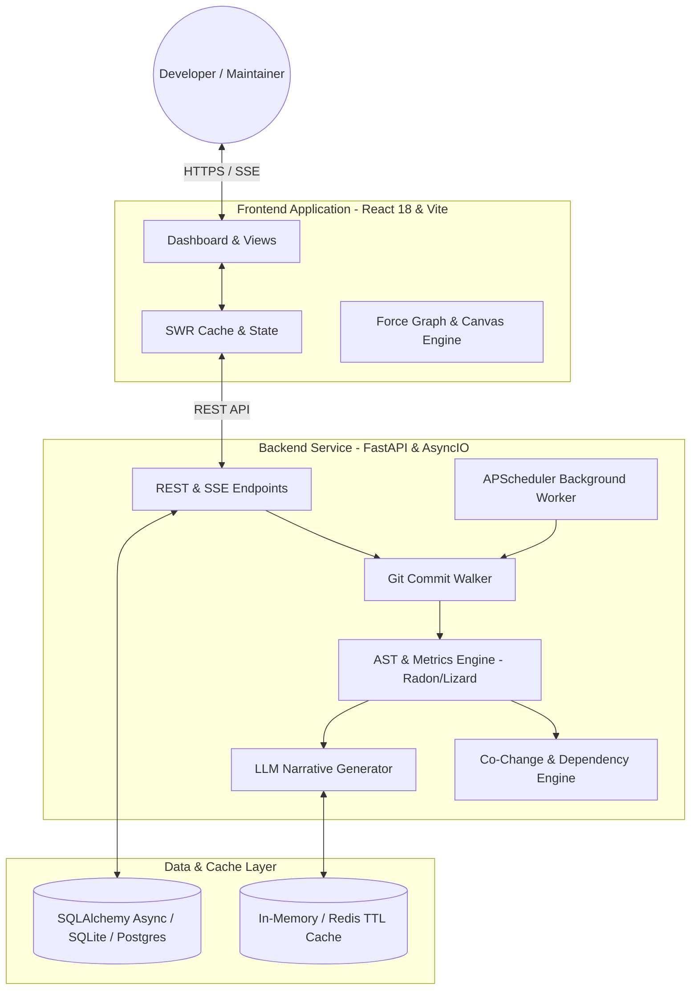

# System Architecture & Technical Design

CommitIQ is structured as a high-throughput, decoupled client-server platform designed for concurrent repository ingestion, AST-based complexity profiling, co-change graph traversal, and real-time visualization.

---

## Architectural Topology

---

## Component Breakdown

### 1. Ingestion Pipeline (`backend/features/repo_ingestion`)

- **`clone_service.py`**: Executes asynchronous, shallow git clone operations. Automatically detects the default branch (`main`, `master`, or custom branches).
- **`commit_walker.py`**: Traverses commit histories using `GitPython` and git subprocesses with support for merge-commit exclusion (`exclude_merges=True`).
- **Progress Streaming**: Broadcasts live status updates over Server-Sent Events (SSE) from `cloning` to `analyzing` to `ready`.

### 2. AST & Code Quality Analysis (`backend/features/metrics`)

- **`complexity.py`**: Evaluates McCabe Cyclomatic Complexity using AST parsing via Radon (for Python) and Lizard (for multi-language repos).
- **`churn.py`**: Calculates file-level and repo-level line additions, deletions, and volatility ratios.
- **`dora.py`**: Computes DORA metrics across deployment frequency, lead time for changes, change failure rate, and MTTR.
- **`cycle_time.py`**: Deconstructs commit lifecycles into Coding, Pickup, Review, and Deploy intervals.
- **`bus_factor.py`**: Calculates ownership concentration matrices using normalized entropy and contributor identity mapping.

### 3. Dependency & Co-Change Graph Engine (`backend/features/graph`)

- Generates an in-memory graph where nodes represent files/modules and edges represent import relationships or co-change patterns.
- Computes PageRank and network centrality to identify critical architectural bottlenecks.

### 4. AI Narrative Layer (`backend/features/llm_analysis`)

- Formats commit diff context and queries Anthropic Claude or Google Gemini via streaming interfaces.
- Employs deterministic local template fallback when API keys are absent or network circuits open (`pybreaker`).
- Caches generated summaries using in-memory TTL or optional Redis connections.

### 5. Frontend Client (`frontend/src`)

- **Core Framework**: React 18, TypeScript, Vite.
- **Data Fetching**: SWR for stale-while-revalidate client-side caching and periodic polling.
- **Visualizations**: Recharts for time-series charts, `react-force-graph-2d` for interactive architectural graphs.
- **Resilience**: Component-level `<ErrorBoundary>` wrappers around analytical modules.

---

## Database Schema & Persistence

CommitIQ uses SQLAlchemy Async ORM supporting SQLite (for local development and zero-config setups) and PostgreSQL (for production multi-tenant environments):

- **`repositories`**: Metadata, clone URL, default branch, ingestion status, and timestamps.
- **`commits`**: SHA, commit message, author metadata, committed timestamp, and parent SHAs.
- **`commit_metrics`**: Pre-computed health scores, cyclomatic complexity, churn, and bus factor metrics per commit.
- **`hotspots`**: Aggregated file-level risk scores and contributor ownership counts.
