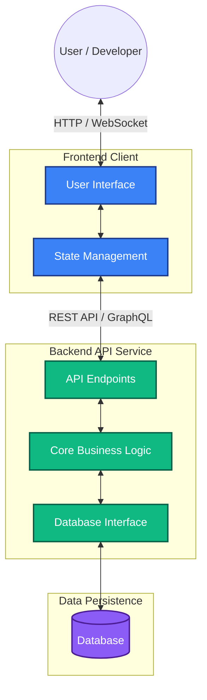

# Architecture Overview

This document provides a high-level overview of the architectural design and structural components of **CommitIQ**. It is intended to help contributors understand how the project is organized and how the different systems interact.

## 🏗️ System Architecture

CommitIQ follows a modernized client-server architecture with separation of concerns.

## 📂 Project Structure

- **`/frontend`**: Contains the client-facing user interface code, responsible for presentation and local state management.
- **`/backend`**: Houses the core server logic, API endpoint definitions, and handles communication with external services and databases.
- **`/migrations`**: Database schema migrations to ensure consistent data structures across environments.
- **`/docs`**: Project documentation, including this architecture file and contributor guidelines.

## ⚙️ Automated Workflows

CommitIQ utilizes robust CI/CD practices to maintain code quality:

- **Prettier Code Formatting**: Automated checks via GitHub Actions ensure that all code changes adhere strictly to the project's formatting standards defined in `.prettierrc`.
- **Testing**: Test runners ensure feature stability before merging.

## 🔮 Future Considerations

As CommitIQ scales, the architecture may expand to include:

- Dedicated caching layers (e.g., Redis) to optimize frequent data reads.
- Microservice separation if specific background tasks require distinct scaling profiles.
