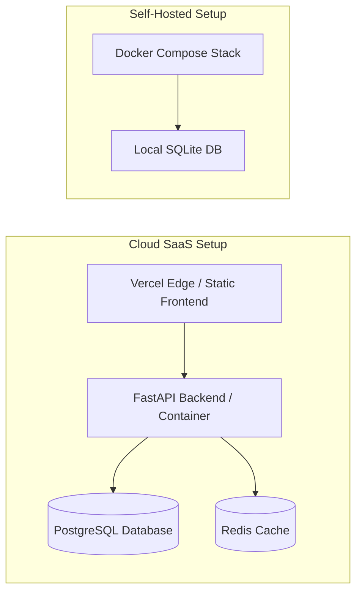

# Deployment & Operations Guide

This guide details deployment topologies, container orchestration, environment variable configuration, and maintenance jobs for CommitIQ in production environments.

---

## Deployment Architectures

CommitIQ supports two deployment configurations:



---

## Production Frontend Deployment (Vercel)

The React frontend is optimized for global edge distribution via Vercel:

```bash
cd frontend
npx vercel --prod
```

### Routing Rules (`frontend/vercel.json`)

```json
{
  "rewrites": [
    {
      "source": "/api/:path*",
      "destination": "https://your-backend-api.com/api/:path*"
    },
    {
      "source": "/(.*)",
      "destination": "/index.html"
    }
  ]
}
```

---

## Containerization with Docker Compose

For on-premise and isolated self-hosted deployments, use Docker Compose:

```bash
docker compose up --build -d
```

### Services:

- `backend`: FastAPI async service listening on port `8000`.
- `frontend`: Production bundle served via Nginx on port `5173`.
- `db`: Optional PostgreSQL database container.

---

## Environment Configuration

| Variable            | Description                                    | Default                                       | Required in Production |
| :------------------ | :--------------------------------------------- | :-------------------------------------------- | :--------------------: |
| `DATABASE_URL`      | SQLAlchemy async connection string             | `sqlite+aiosqlite:///./data/commitiq.db`      |        Optional        |
| `GEMINI_API_KEY`    | Google Gemini API key for narrative generation | `None` (Falls back to deterministic template) |      Recommended       |
| `ANTHROPIC_API_KEY` | Anthropic Claude API key                       | `None`                                        |        Optional        |
| `REDIS_URL`         | Redis connection URL for narrative caching     | `None` (Falls back to in-memory TTL cache)    |        Optional        |
| `CORS_ORIGINS`      | Comma-separated list of allowed origins        | `http://localhost:5173`                       |          Yes           |
| `LOG_LEVEL`         | Application logging verbosity                  | `INFO`                                        |           No           |

---

## Periodic Synchronization (APScheduler)

CommitIQ runs a non-blocking background job every 24 hours using `AsyncIOScheduler`:

- Periodically reviews registered repositories for commit updates.
- Refreshes complexity, churn, and DORA metrics without degrading interactive API responsiveness.
- Automatically marks stale, orphaned ingestion runs as failed on application reboot.
