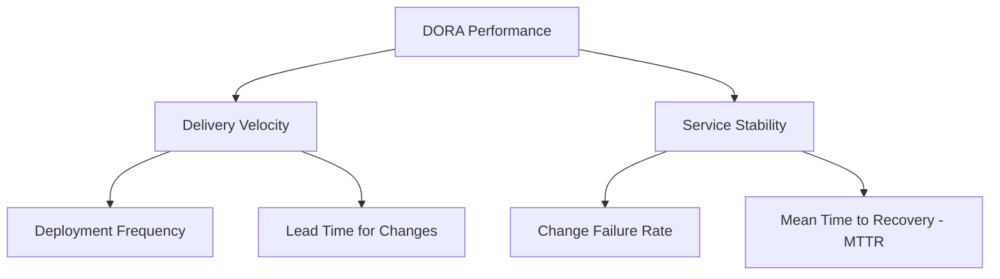
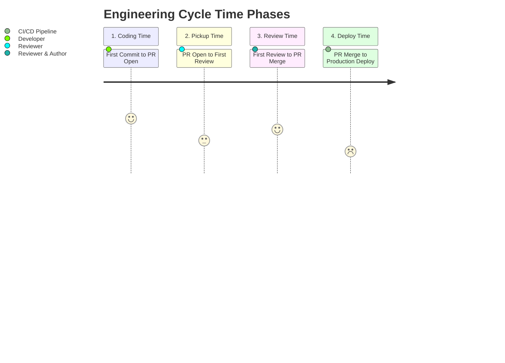

# DORA Metrics & Cycle Time Analytics

CommitIQ provides engineering organizations with real-time, commit-level DORA (DevOps Research and Assessment) metrics and software delivery cycle time analytics.

---

## DORA Metrics Overview

DORA metrics measure software delivery performance and operational stability across four core indicators:



### 1. Deployment Frequency

Measures the frequency of successful code deployments to production or merges to the default branch.

- **Elite**: Multiple deployments per day
- **High**: Between once per day and once per week
- **Medium**: Between once per week and once per month
- **Low**: Fewer than once per month

### 2. Lead Time for Changes

Measures the elapsed duration from the initial commit authored in a branch to the point where that change is deployed to production.

$$\text{Lead Time} = T_{\text{deploy}} - T_{\text{first commit}}$$

### 3. Change Failure Rate (CFR)

The percentage of production releases resulting in service degradation, rollbacks, or immediate remediations.

$$\text{CFR} = \left(\frac{N_{\text{failed deployments}}}{N_{\text{total deployments}}}\right) \times 100\%$$

### 4. Mean Time to Restore Service (MTTR)

The average duration required to restore full service availability following an unplanned outage or production regression.

---

## Cycle Time Breakdown

CommitIQ decomposes engineering cycle time into four phases to isolate workflow bottlenecks:



### Phase Definitions

| Phase           | Measurement Boundary                                         | Optimization Strategy                                     |
| :-------------- | :----------------------------------------------------------- | :-------------------------------------------------------- |
| **Coding Time** | First commit created $\rightarrow$ Pull request opened       | Break features into smaller, atomic increments.           |
| **Pickup Time** | Pull request opened $\rightarrow$ First reviewer interaction | Establish team review rotations and triage notifications. |
| **Review Time** | First review $\rightarrow$ Pull request approved and merged  | Minimize asynchronous discussion rounds.                  |
| **Deploy Time** | Pull request merged $\rightarrow$ Successful deployment      | Automate CI/CD validation and staging pipelines.          |

---

## Time-Window Filtering

DORA and Cycle Time endpoints accept ISO 8601 UTC timestamp parameters (`start_date` and `end_date`) to calculate metrics over specific evaluation intervals.

### Request Example

```http
GET /api/repos/1/dora?start_date=2026-08-01T00:00:00Z&end_date=2026-08-28T23:59:59Z HTTP/1.1
Host: localhost:8000
```

### Response Schema

```json
{
  "repo_id": 1,
  "time_window": {
    "start_date": "2026-08-01T00:00:00Z",
    "end_date": "2026-08-28T23:59:59Z"
  },
  "deployment_frequency": {
    "count": 42,
    "rate_per_day": 1.5,
    "tier": "Elite"
  },
  "lead_time_for_changes_hours": 18.4,
  "change_failure_rate_pct": 4.76,
  "mttr_hours": 1.2
}
```
